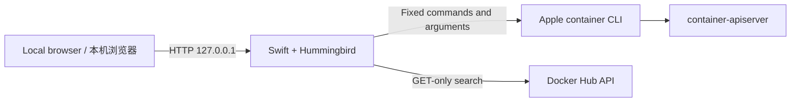

# Container GUI

A lightweight local web interface for Apple [`container`](https://github.com/apple/container), built with Swift, Hummingbird, and build-free HTML, CSS, and JavaScript.

面向 Apple [`container`](https://github.com/apple/container) 的轻量级本机 Web 管理界面，使用 Swift、Hummingbird 和无需构建的原生 HTML、CSS、JavaScript 开发。

[中文](#中文说明) · [English](#english-guide)

**GUI v2.15.1** · Apple `container` `1.3.x` · `http://127.0.0.1:8787`

> Container GUI is a local, single-user tool. It never listens on the LAN or public Internet and is not a replacement for Docker Desktop, Compose, Kubernetes, or a multi-user remote administration platform.
>
> Container GUI 是单用户本机工具，不监听局域网或公网，也不是 Docker Desktop、Compose、Kubernetes 或多用户远程管理平台的替代品。

## 中文说明

### 项目简介

Container GUI 为 Apple `container` CLI 提供浏览器管理界面。后端直接读取 CLI 权威状态，不维护容器或镜像的影子数据库；所有写操作都使用固定子命令和结构化参数，并在完成后重新读取实际状态。

主要能力：

| 任务 | 当前能力 |
| --- | --- |
| 查看容器 | 展示运行状态、镜像、IPv4/IPv6、CPU、内存和根文件系统容量，每 5 秒刷新 |
| 查看详情 | 同一个按钮展开或收起详情；支持脱敏原始信息、最近日志和实时日志 |
| 生命周期管理 | 启动、正常停止、重启和安全删除，并进行目标确认与状态回读 |
| 本机镜像 | 折叠/展开、每页 10 条数字分页、真实拉取进度、安全删除未引用镜像 |
| Docker Hub | 搜索公开仓库和标签，每页 10 条数字分页；选择标签不会自动拉取 |
| 创建容器 | 配置名称、CPU、内存、回环端口、环境变量、进程参数和一个共享目录 |
| SSH 快速配置 | Debian/Ubuntu 镜像仅公钥登录、自定义本机端口、普通用户或显式 root 模式 |
| Odoo 快速配置 | 官方 Odoo 镜像显示数据库地址、端口及 `/mnt/extra-addons` 自定义模块目录 |
| 现代界面 | Material 3 浅色/深色主题、克制 glass 表面、渐进动效及无障碍回退 |

### 环境要求

- Apple silicon Mac
- macOS 26
- Xcode 提供的 Swift 6.1 或更高版本
- Apple `container` CLI `1.3.x`；当前验证基线为 `1.3.1`

从 Apple 官方 [Releases](https://github.com/apple/container/releases) 安装签名安装包，然后确认 CLI 和系统服务可用：

```bash
container --version
container system start
container system status
```

### 快速开始

```bash
git clone https://github.com/zeal-odoo/ContainerGui.git
cd ContainerGui
swift package resolve
swift run ContainerGUI
```

浏览器打开：

```text
http://127.0.0.1:8787/
```

服务固定监听 `127.0.0.1`。如果端口 `8787` 已被占用：

```bash
CONTAINER_GUI_PORT=9876 swift run ContainerGUI
```

### 创建普通容器

点击“创建容器”，选择本机镜像或填写完整镜像引用，再按需配置 CPU、内存和端口。所有主机端口都固定绑定到 `127.0.0.1`，可用范围为 `1024...65535`。

Ubuntu 等镜像没有常驻进程时，可勾选“保持容器运行”。GUI 会使用固定进程参数，无需手动输入：

```text
/bin/bash
-lc
exec sleep infinity
```

PostgreSQL、Nginx、Odoo 等已有常驻主进程的镜像不需要启用该选项。

### 挂载本机目录与配置 Odoo

- 普通镜像：本机目录默认挂载到容器 `/workspace`，用于本机与容器之间传输文件。
- 官方 Odoo 镜像：本机目录固定挂载到 `/mnt/extra-addons`，用于加载自定义模块。
- 每次创建最多配置一个共享目录，本机目录必须已经存在。

只有选择 Docker Hub 官方 `odoo` 镜像时，GUI 才显示数据库地址和端口。数据库地址必须能从 Odoo 容器内部访问，不能把浏览器访问的 `127.0.0.1` 直接当作另一个容器的数据库地址。

示例：

```text
数据库地址: postgres-odoo-apple
数据库端口: 5432
本机模块目录: /Users/alice/ContainerGuiShared/odoo-addons
容器模块目录: /mnt/extra-addons
```

实际数据库主机名取决于 Apple Container 网络配置。容器显示“运行中”并不代表 Odoo 已成功连接数据库；出现 HTTP 500 时应先检查 Odoo 日志和数据库可达性。

### 配置仅公钥 SSH

在创建表单中启用“SSH 快速配置”，选择高位本机端口并粘贴 `.pub` 公钥，或在浏览器中生成 RSA-3072 密钥对。公钥会写入容器；私钥只在当前浏览器生成并下载一次，不会上传或由 Swift 服务保存。

普通用户登录示例：

```bash
KEY_FILE="$(find "$HOME/Downloads" -maxdepth 1 -type f -name 'id_container_gui_ssh_*' -print | sort | tail -n 1)"
chmod 600 "$KEY_FILE"
ssh -i "$KEY_FILE" -p 2222 dev@127.0.0.1
```

GUI 也支持显式 root 公钥登录。root 模式仍禁用密码、键盘交互和空密码认证，但登录后拥有完整容器权限。只有详情显示“可连接”时，才表示映射端口已返回真实 SSH 协议横幅。

停止并重新启动同一个容器会保留端口、授权公钥和 SSH 主机密钥；删除并重建后主机指纹可能改变。自动 SSH 初始化目前只支持能够以 root 执行 `apt-get` 的 Debian/Ubuntu 系镜像。

### 安全模型

- 服务固定监听 `127.0.0.1`，不接受局域网或公网连接。
- 浏览器只提交结构化字段；服务端不提供任意主机 shell 或任意 `container` 子命令入口。
- 启动、停止、重启、创建、拉取和删除均具有操作记录、目标互斥、幂等保护和完成后的状态回读。
- 删除不使用 `--all` 或 `--force`；运行中容器、被引用镜像和 Apple `vminit` 系统镜像受到保护。
- 环境变量值和公钥不会进入操作摘要或详情回显；私钥从不发送到服务端。
- Docker Hub 搜索是只读操作，只有用户明确提交拉取表单后才下载镜像。
- 本项目适用于本机开发与实验环境，不构成生产编排、远程管理或多用户权限隔离方案。

### 配置参数

| 环境变量 | 必填 | 默认值 | 说明 |
| --- | --- | --- | --- |
| `CONTAINER_GUI_PORT` | 否 | `8787` | 本机监听端口，必须为 `1024...65535` |
| `CONTAINER_GUI_CLI_PATH` | 否 | 自动查找 | 指定 `container`；默认检查 `/usr/local/bin`、`/opt/homebrew/bin` 和 `PATH` |
| `CONTAINER_GUI_LIVE_READONLY` | 否 | 未启用 | 设为 `1` 后允许测试读取真实 CLI 状态，不执行写操作 |
| `CONTAINER_GUI_LIVE_REGISTRY_READONLY` | 否 | 未启用 | 设为 `1` 后允许测试执行 Docker Hub GET-only 搜索与标签读取 |

### 常见问题

| 现象 | 检查方式 |
| --- | --- |
| 页面一直显示“正在读取” | 运行 `container system status --format json`，再检查 `curl -fsS http://127.0.0.1:8787/api/v1/system/health` |
| 页面显示 CLI 不可用 | 运行 `container --version`；CLI 不在常见路径时设置 `CONTAINER_GUI_CLI_PATH` |
| 容器启动后立即停止 | 查看最近日志；无常驻进程的普通镜像可重新创建并启用“保持容器运行” |
| SSH 长时间停在“初始化中” | 检查容器日志、镜像是否支持 `apt-get` 以及本机端口是否冲突 |
| Odoo 返回 HTTP 500 | 核对容器内数据库地址、5432 可达性、数据库凭据、共享目录权限和 Odoo 日志 |
| 镜像无法删除 | 确认没有容器引用该镜像；Apple `vminit` 系统镜像不可由 GUI 删除 |

### 开发与验证

```bash
swift package resolve
swift build
DEVELOPER_DIR=/Applications/Xcode.app/Contents/Developer swift test
node --test Tests/Frontend/*.mjs
node --check Sources/ContainerGUI/Resources/Public/app.js
node --check Sources/ContainerGUI/Resources/Public/pagination.js
```

默认测试使用固定夹具和模拟命令执行器，不修改真实容器。只有显式设置对应实时只读环境变量后，测试才会读取本机 CLI 或 Docker Hub。

## English guide

### Overview

Container GUI adds a browser-based management interface to Apple’s `container` CLI. The Swift backend reads authoritative CLI state instead of maintaining a shadow database. Every mutation uses fixed subcommands, structured arguments, and a post-operation readback.

Key capabilities:

| Task | Current capability |
| --- | --- |
| Inspect containers | View runtime state, image, IPv4/IPv6, CPU, memory, and root-filesystem capacity with a five-second refresh interval |
| Inspect details | Use the same button to open or close details, with redacted raw data, recent logs, and live logs |
| Manage lifecycle | Start, gracefully stop, restart, and safely delete containers with target confirmation and authoritative readback |
| Manage local images | Collapse or expand the section, browse numbered 10-item pages, view real pull progress, and safely delete unused images |
| Browse Docker Hub | Search public repositories and tags using numbered 10-item pages; selecting a tag does not pull it automatically |
| Create containers | Configure name, CPU, memory, loopback ports, environment variables, process arguments, and one shared directory |
| Configure SSH | Bootstrap public-key-only SSH for supported Debian/Ubuntu images with a custom host port and normal-user or explicit root mode |
| Configure Odoo | Show database host/port and the `/mnt/extra-addons` custom-module directory only for the official Odoo image |
| Use a modern UI | Material 3 light/dark themes, restrained glass surfaces, progressive motion, and accessibility fallbacks |

### Requirements

- Apple silicon Mac
- macOS 26
- Swift 6.1 or later from Xcode
- Apple `container` CLI `1.3.x`; the current verified baseline is `1.3.1`

Install the signed package from Apple’s official [Releases](https://github.com/apple/container/releases), then verify the CLI and system service:

```bash
container --version
container system start
container system status
```

### Quick start

```bash
git clone https://github.com/zeal-odoo/ContainerGui.git
cd ContainerGui
swift package resolve
swift run ContainerGUI
```

Open:

```text
http://127.0.0.1:8787/
```

The service always binds to `127.0.0.1`. To use another local port:

```bash
CONTAINER_GUI_PORT=9876 swift run ContainerGUI
```

### Create a regular container

Select “Create container,” choose a local image or enter a full image reference, then configure CPU, memory, and ports as needed. Every host port is bound to `127.0.0.1` and must be within `1024...65535`.

For an image such as Ubuntu whose default process exits immediately, enable “Keep container running.” The GUI supplies these fixed process arguments:

```text
/bin/bash
-lc
exec sleep infinity
```

Do not enable this preset for images such as PostgreSQL, Nginx, or Odoo that already have a persistent main process.

### Mount a directory and configure Odoo

- Regular images mount the selected host directory at `/workspace` for file exchange.
- The official Odoo image mounts the host directory at `/mnt/extra-addons` for custom modules.
- Each create request accepts at most one shared directory, and the host directory must already exist.

Database host and port fields appear only for the official Docker Hub `odoo` image. The database address must be reachable from inside the Odoo container. Do not use the browser-facing `127.0.0.1` as the address of a database running in another container.

Example:

```text
Database host: postgres-odoo-apple
Database port: 5432
Host module directory: /Users/alice/ContainerGuiShared/odoo-addons
Container module directory: /mnt/extra-addons
```

The correct database hostname depends on the Apple Container network configuration. A running Odoo container does not prove database connectivity. If Odoo returns HTTP 500, inspect the Odoo logs and database reachability first.

### Configure public-key-only SSH

Enable “SSH quick configuration” in the create form, choose an unprivileged local port, and paste a `.pub` public key or generate an RSA-3072 key pair in the browser. The public key is written to the container. The private key is generated in the current browser, downloaded once, and never uploaded to or stored by the Swift service.

Normal-user login example:

```bash
KEY_FILE="$(find "$HOME/Downloads" -maxdepth 1 -type f -name 'id_container_gui_ssh_*' -print | sort | tail -n 1)"
chmod 600 "$KEY_FILE"
ssh -i "$KEY_FILE" -p 2222 dev@127.0.0.1
```

The GUI also offers an explicit root public-key mode. Password, keyboard-interactive, and empty-password authentication remain disabled, but a root session has full control of the container. Treat SSH as ready only when the details panel reports “Ready,” which requires a real SSH protocol banner from the mapped port.

Stopping and starting the same container preserves its port, authorized key, and SSH host keys. Deleting and recreating it may change the host fingerprint. Automatic SSH bootstrap currently supports Debian/Ubuntu-family images that can run `apt-get` as root.

### Security model

- The server always listens on `127.0.0.1` and rejects LAN or public access.
- The browser submits structured fields only; the backend does not expose arbitrary host-shell or arbitrary `container` command execution.
- Start, stop, restart, create, pull, and delete operations use operation records, per-target exclusion, idempotency protection, and post-operation readback.
- Delete workflows never use `--all` or `--force`; running containers, referenced images, and Apple’s `vminit` system image are protected.
- Environment values and public keys are omitted from operation summaries and detail readbacks. Private keys never reach the server.
- Docker Hub search is read-only. Images are downloaded only after an explicit pull submission.
- This project is designed for local development and experimentation, not production orchestration, remote administration, or multi-user isolation.

### Configuration

| Environment variable | Required | Default | Description |
| --- | --- | --- | --- |
| `CONTAINER_GUI_PORT` | No | `8787` | Local listening port; must be within `1024...65535` |
| `CONTAINER_GUI_CLI_PATH` | No | Auto-detected | Explicit `container` executable; otherwise checks `/usr/local/bin`, `/opt/homebrew/bin`, and `PATH` |
| `CONTAINER_GUI_LIVE_READONLY` | No | Disabled | Set to `1` to let tests read the real local CLI without mutations |
| `CONTAINER_GUI_LIVE_REGISTRY_READONLY` | No | Disabled | Set to `1` to let tests perform GET-only Docker Hub repository/tag reads |

### Troubleshooting

| Symptom | What to check |
| --- | --- |
| The page remains on “Loading” | Run `container system status --format json`, then check `curl -fsS http://127.0.0.1:8787/api/v1/system/health` |
| The CLI is unavailable | Run `container --version`; set `CONTAINER_GUI_CLI_PATH` if the executable is outside the usual paths |
| A container stops immediately | Read recent logs; recreate an ordinary image with “Keep container running” if it has no persistent process |
| SSH remains “Initializing” | Check container logs, `apt-get` support, and host-port conflicts; a running container is not proof of SSH readiness |
| Odoo returns HTTP 500 | Verify the in-container database address, port 5432 reachability, credentials, shared-directory permissions, and Odoo logs |
| An image cannot be deleted | Confirm that no container references it; the Apple `vminit` system image cannot be deleted by the GUI |

### Development and verification

```bash
swift package resolve
swift build
DEVELOPER_DIR=/Applications/Xcode.app/Contents/Developer swift test
node --test Tests/Frontend/*.mjs
node --check Sources/ContainerGUI/Resources/Public/app.js
node --check Sources/ContainerGUI/Resources/Public/pagination.js
```

The default test suite uses fixed fixtures and fake command executors, so it does not modify real containers. Tests read the local CLI or Docker Hub only when the corresponding live read-only environment variable is explicitly enabled.

## Architecture and specifications



Source code is under `Sources/ContainerGUI`, static frontend resources are under `Sources/ContainerGUI/Resources/Public`, and behavior specifications and validation evidence are under [`specs`](specs).

源码位于 `Sources/ContainerGUI`，前端静态资源位于 `Sources/ContainerGUI/Resources/Public`，行为规格及验收证据位于 [`specs`](specs)。

- [基础容器管理 / Core container management](specs/001-container-web-gui/spec.md)
- [镜像拉取、创建与 Docker Hub 浏览 / Image pull, creation, and Docker Hub](specs/003-image-pull-create/spec.md)
- [SSH 快速配置 / SSH quick configuration](specs/004-ssh-quick-config/spec.md)
- [root 公钥登录 / Root public-key login](specs/005-root-ssh-key-login/spec.md)
- [Odoo 与共享目录 / Odoo and shared directories](specs/006-odoo-shared-directory/spec.md)
- [容器重启 / Container restart](specs/007-container-restart/spec.md)
- [存储容量 / Storage capacity](specs/008-container-storage-capacity/spec.md)
- [Material 3、glass 与分页 / Material 3, glass, and pagination](specs/011-glass-detail-pagination/spec.md)
