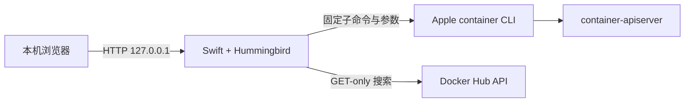

# Container GUI

面向 Apple [`container`](https://github.com/apple/container) CLI 的轻量级本机管理界面，以 Swift、Hummingbird 和原生 Web 技术构建。

A lightweight, local web interface for Apple’s [`container`](https://github.com/apple/container) CLI, built with Swift, Hummingbird, and build-free web technologies.

**当前版本 / Current version:** GUI `v2.13.1` · Apple `container` `1.3.x` 兼容 · `127.0.0.1:8787`

> Container GUI 是单用户、本机回环工具。它不监听局域网或公网，也不是 Docker Desktop、Kubernetes、Compose 或多用户远程控制平台。

## 快速开始

### 环境要求

- Apple silicon Mac
- macOS 26（Apple `container` 当前支持的系统版本）
- Xcode 提供的 Swift 6.1 或更高版本
- Apple `container` CLI `1.3.x`；本项目当前验证基线为 `1.3.1`

先从 Apple 官方 [Releases](https://github.com/apple/container/releases) 安装签名安装包，然后确认 CLI 和系统服务可用：

```bash
container --version
container system start
container system status
```

构建并启动 Container GUI：

```bash
git clone https://github.com/zeal-odoo/ContainerGui.git
cd ContainerGui
swift package resolve
swift run ContainerGUI
```

浏览器打开：

```text
http://127.0.0.1:8787/
```

服务只绑定 `127.0.0.1`。如果端口 `8787` 已被占用，可使用：

```bash
CONTAINER_GUI_PORT=9876 swift run ContainerGUI
```

## 可以完成什么

| 任务 | 当前能力 |
| --- | --- |
| 查看容器 | 展示运行状态、镜像、IPv4/IPv6、CPU、内存和根文件系统容量，并每 5 秒读取权威状态 |
| 查看详情 | 同一个“查看详情”按钮可展开或收起详情；支持脱敏原始信息、最近日志和实时日志 |
| 控制生命周期 | 对合法状态提供启动、正常停止、重启和删除；危险操作必须确认并完成 CLI 状态回读 |
| 管理镜像 | 展示并折叠全部本机镜像、显示真实拉取进度、安全删除未引用镜像，并保护 Apple `vminit` 系统镜像 |
| 浏览 Docker Hub | 搜索公开仓库和标签，仓库及标签均按每页 20 条翻页；选择标签只填写拉取表单，不会自动拉取 |
| 创建容器 | 配置名称、CPU、内存、回环端口、环境变量、进程参数、一个共享目录，以及创建后是否启动 |
| 快速配置 SSH | 为受支持的 Debian/Ubuntu 镜像配置仅公钥 SSH、自定义本机端口、普通用户或显式 root 登录，并检测真实 SSH 横幅 |
| 创建 Odoo 容器 | 官方 Odoo 镜像自动显示数据库地址/端口和自定义模块目录，模块目录固定挂载到 `/mnt/extra-addons` |
| 使用现代界面 | Material 3 浅色/深色主题、克制 glass 表面、渐进动效，以及减少动态和降低透明度回退 |

## 常用操作

### 创建普通容器

点击“创建容器”，选择本机镜像或填写镜像引用，再按需配置 CPU、内存和端口。所有主机端口都固定绑定到 `127.0.0.1`，范围为 `1024...65535`。

如果 Ubuntu 等镜像没有常驻进程，可勾选“保持容器运行”。GUI 会使用固定参数：

```text
/bin/bash
-lc
exec sleep infinity
```

PostgreSQL、Nginx、Odoo 等已经具有常驻主进程的镜像不需要这个选项。

### 挂载本机目录

- 普通镜像：本机目录默认挂载到容器 `/workspace`，可用于本机与容器之间交换文件。
- 官方 Odoo 镜像：目标固定为 `/mnt/extra-addons`，用于加载自定义模块。
- 当前每个容器创建请求最多配置一个共享目录；本机目录必须已经存在。

### 配置 Odoo

选择 Docker Hub 官方 `odoo` 镜像后，GUI 才会显示数据库地址和端口字段。数据库地址必须能从 Odoo 容器内部访问；如果 PostgreSQL 位于另一个容器中，不要把浏览器访问的 `127.0.0.1` 当作容器内数据库地址。

一个典型配置是：

```text
数据库地址: postgres-odoo-apple
数据库端口: 5432
本机模块目录: /Users/alice/ContainerGuiShared/odoo-addons
容器模块目录: /mnt/extra-addons
```

实际数据库主机名取决于你的 Apple Container 网络配置。容器显示为“运行中”并不等于 Odoo 已经能够连接数据库；出现 HTTP 500 时应先查看 Odoo 日志和数据库可达性。

### 配置仅公钥 SSH

在创建表单中启用“SSH 快速配置”，选择高位本机端口并粘贴 `.pub` 公钥，或让浏览器生成 RSA-3072 密钥对。公钥会写入容器，私钥只在当前浏览器生成并下载一次，不会上传或由 Swift 服务保存。

普通用户示例：

```bash
KEY_FILE="$(find "$HOME/Downloads" -maxdepth 1 -type f -name 'id_container_gui_ssh_*' -print | sort | tail -n 1)"
chmod 600 "$KEY_FILE"
ssh -i "$KEY_FILE" -p 2222 dev@127.0.0.1
```

GUI 也支持显式选择 `root` 公钥登录。root 模式仍禁用密码、键盘交互和空密码认证，但登录后拥有完整容器权限，请谨慎使用。只有详情显示“可连接”时，才表示映射端口已经返回真实 SSH 协议横幅。

停止并重新启动同一个容器会保留端口、授权公钥和 SSH 主机密钥；删除并重建后主机指纹可能改变。SSH 自动初始化目前只支持能够以 root 执行 `apt-get` 的 Debian/Ubuntu 系镜像。

## 安全模型

- 服务固定监听 `127.0.0.1`，不接受局域网或公网连接。
- 浏览器只能提交结构化字段；服务端使用固定 CLI 子命令和独立参数，不提供任意主机 shell 或任意 `container` 子命令入口。
- 启动、停止、重启、创建、拉取和删除都具有操作记录、目标互斥、幂等保护和完成后的独立状态回读。
- 删除不使用 `--all` 或 `--force`；运行中容器、被引用镜像和 Apple 系统镜像受到保护。
- 环境变量值、公钥等敏感内容不会进入操作摘要或详情回显；私钥从不发送到服务端。
- Docker Hub 搜索是只读操作；只有用户明确提交拉取表单后才会下载镜像。
- 本项目适合本机开发和实验环境，不构成生产部署、远程管理或多用户权限隔离方案。

## 配置

| 环境变量 | 必填 | 默认值 | 说明 |
| --- | --- | --- | --- |
| `CONTAINER_GUI_PORT` | 否 | `8787` | 本机监听端口，必须为 `1024...65535` |
| `CONTAINER_GUI_CLI_PATH` | 否 | 自动查找 | 指定 `container` 可执行文件；默认检查 `/usr/local/bin`、`/opt/homebrew/bin` 和 `PATH` |
| `CONTAINER_GUI_LIVE_READONLY` | 否 | 未启用 | 设为 `1` 时允许测试读取本机真实 CLI 状态，不执行写操作 |
| `CONTAINER_GUI_LIVE_REGISTRY_READONLY` | 否 | 未启用 | 设为 `1` 时允许测试执行 Docker Hub GET-only 搜索和标签读取 |

## 排查问题

| 现象 | 检查方式 |
| --- | --- |
| 页面一直显示“正在读取” | 运行 `container system status --format json`，再检查 `curl -fsS http://127.0.0.1:8787/api/v1/system/health` |
| 页面显示 CLI 不可用 | 运行 `container --version`；如果 CLI 不在常见路径，设置 `CONTAINER_GUI_CLI_PATH` |
| 容器启动后立即停止 | 查看最近日志；普通无常驻进程镜像可重新创建并启用“保持容器运行” |
| SSH 长时间停在“初始化中” | 检查容器日志、镜像是否支持 `apt-get`、本机端口是否冲突；“运行中”不代表 SSH 已就绪 |
| Odoo 返回 HTTP 500 | 优先核对容器内数据库地址、5432 可达性、数据库凭据、共享模块权限和 Odoo 日志 |
| 镜像无法删除 | 先确认没有容器引用该镜像；Apple `vminit` 系统镜像不可由 GUI 删除 |

## 开发与验证

```bash
swift package resolve
swift build
DEVELOPER_DIR=/Applications/Xcode.app/Contents/Developer swift test
node --test Tests/Frontend/*.mjs
node --check Sources/ContainerGUI/Resources/Public/app.js
```

默认自动化测试使用固定夹具和模拟命令执行器，不修改真实容器。两个实时只读测试只有显式设置对应环境变量后才运行。



核心代码位于 `Sources/ContainerGUI`，前端静态资源位于 `Sources/ContainerGUI/Resources/Public`，行为规格和验收证据位于 [`specs`](specs)。

相关规格：

- [基础容器管理](specs/001-container-web-gui/spec.md)
- [镜像拉取、创建与 Docker Hub 浏览](specs/003-image-pull-create/spec.md)
- [SSH 快速配置](specs/004-ssh-quick-config/spec.md) 与 [root 公钥登录](specs/005-root-ssh-key-login/spec.md)
- [Odoo 与共享目录](specs/006-odoo-shared-directory/spec.md)
- [容器重启](specs/007-container-restart/spec.md) 与 [存储容量](specs/008-container-storage-capacity/spec.md)
- [Material 3、glass 与分页](specs/011-glass-detail-pagination/spec.md)

## English

Container GUI is a local, single-user dashboard for Apple’s `container` CLI. It reads authoritative CLI state instead of maintaining a shadow database and exposes constrained workflows for container lifecycle management, logs, resource metrics, image management, Docker Hub browsing, container creation, SSH bootstrap, shared directories, and official Odoo image configuration.

### Quick start

Install Apple `container` from its official release, start the container system, then run:

```bash
git clone https://github.com/zeal-odoo/ContainerGui.git
cd ContainerGui
container system start
swift package resolve
swift run ContainerGUI
```

Open `http://127.0.0.1:8787/`.

### Highlights

- Live container state plus CPU, memory, root-filesystem capacity, addresses, redacted details, and logs.
- Confirmed start, graceful stop, restart, and safe deletion with authoritative readback.
- Local image inventory, real pull progress, protected deletion, and Docker Hub repository/tag pagination at 20 items per page.
- Structured container creation with CPU, memory, loopback ports, environment variables, process arguments, one shared directory, and optional start.
- Public-key-only SSH for supported Debian/Ubuntu images, including browser-local key generation, custom ports, normal-user or explicit root mode, and actual SSH-banner readiness checks.
- Official Odoo image mode with `/mnt/extra-addons` and database host/port fields; other images use a configurable shared directory such as `/workspace`.
- Material 3 light/dark themes, restrained glass surfaces, progressive motion, and reduced-motion/transparency fallbacks.

### Security and limitations

The server always binds to `127.0.0.1`. It does not provide arbitrary host-shell or arbitrary `container` command execution. Destructive actions require explicit confirmation and independent readback; private keys never leave the browser. This project is intended for local development and experimentation, not remote administration, multi-user isolation, Compose, Kubernetes, or production orchestration.

See the Chinese sections above for detailed workflows, configuration, troubleshooting, testing, and specification links.
